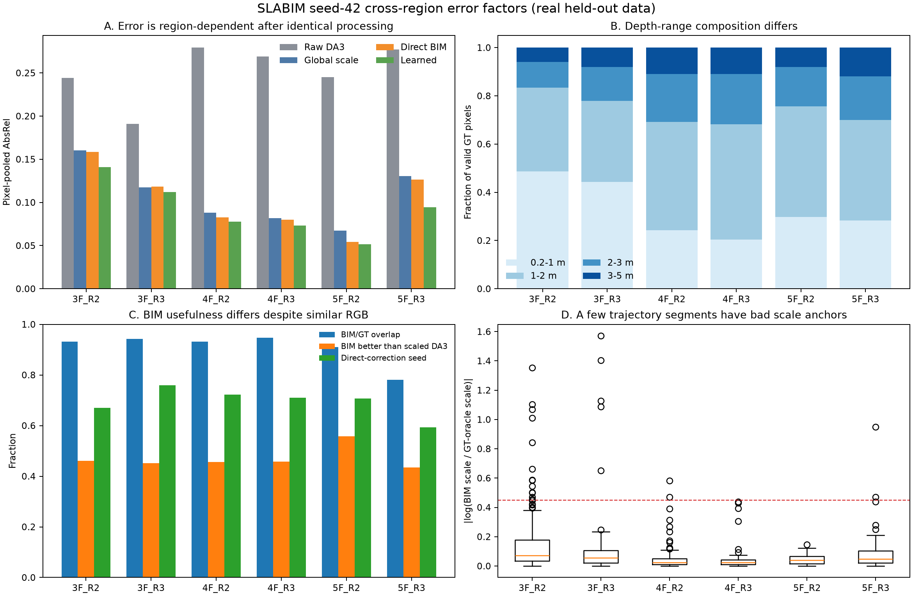
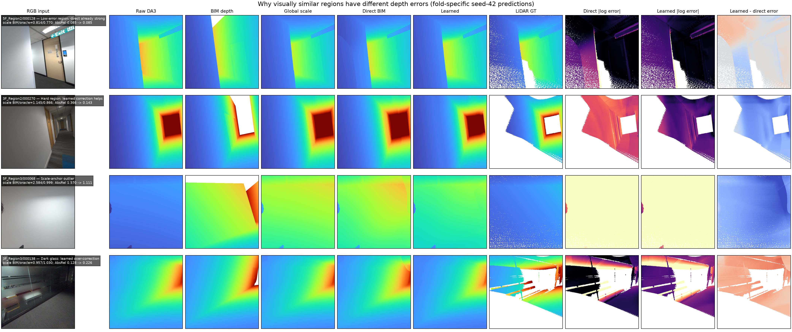
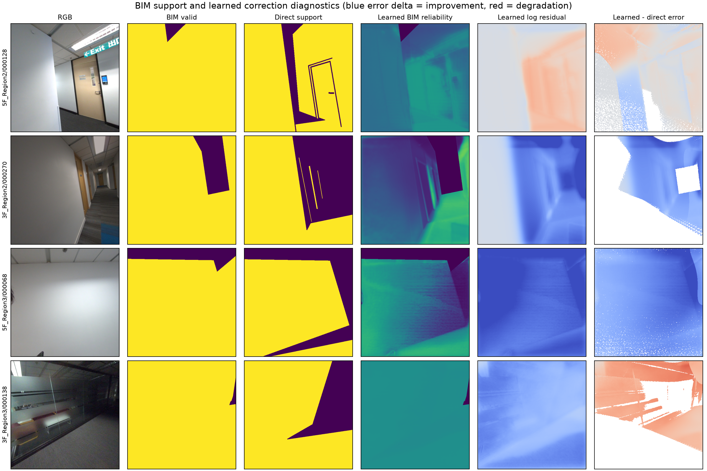

# 不同区域深度误差差异分析

## 1. 结论

六个区域的 RGB 大多是相似的室内走廊、门、墙面和吊顶，但误差差异的首要原因
不是 RGB 外观，而是：

1. **部分轨迹段的 BIM 全局尺度锚点发生严重偏差**；
2. **BIM 与现场/GT 的几何一致性和有效局部信息量不同**；
3. **现有网络的残差范围和近距离路由无法恢复严重错误的尺度起点**；
4. 深度分布、暗光/玻璃、GT 像素权重和少量异常帧进一步改变区域均值。

在全部 729 个 seed-42 外层测试帧上，诊断用的
\(|\log(s_{\mathrm{BIM}}/s_{\mathrm{GT-oracle}})|\) 与逐帧 Direct BIM AbsRel
的 Spearman 相关系数为 **0.773**，与 Learned AbsRel 的相关系数为
**0.647**。这是当前统计中最强的单一解释因素。

这里的 GT-oracle scale 只用于离线诊断，部署时不可获得。

## 2. 区域统计

| 区域 | Direct AbsRel | Learned AbsRel | BIM/GT overlap | BIM-GT 平均对数误差 | 坏尺度帧率 | Direct 相对 global-scale |
|---|---:|---:|---:|---:|---:|---:|
| 3F_R2 | 0.1586 | 0.1408 | 93.1% | 0.222 | 7.47% | +1.02% |
| 3F_R3 | 0.1184 | 0.1118 | 94.3% | 0.161 | 2.87% | −0.69% |
| 4F_R2 | 0.0825 | 0.0777 | 93.1% | 0.160 | 1.28% | +6.29% |
| 4F_R3 | 0.0798 | 0.0734 | 94.7% | 0.152 | 0.00% | +2.73% |
| 5F_R2 | 0.0541 | 0.0517 | 91.0% | 0.131 | 0.00% | +19.81% |
| 5F_R3 | 0.1267 | 0.0943 | 78.1% | 0.230 | 2.44% | +3.00% |

“坏尺度帧”在本分析中定义为：

\[
\left|\log\frac{s_{\mathrm{BIM}}}{s_{\mathrm{GT-oracle}}}\right|>0.45.
\]

该阈值只用于解释误差尾部，不是已经验证的部署阈值。



图中可以看到：

- 5F_R2 的 BIM/GT 对数误差最低、尺度尾部最干净，Direct BIM 因而最好；
- 3F_R2 虽然 BIM 覆盖率很高，但 BIM/GT 误差和尺度异常率较高，说明
  **覆盖多不等于对齐正确**；
- 5F_R3 同时具有最低 overlap 和最高 BIM/GT 误差，并受单个极端尺度帧支配；
- 4F_R3 的远距离像素占比很高，但总体误差仍低，因此深度远近不是主因。

## 3. 主因一：BIM 全局尺度锚点的重尾异常

当前逐帧尺度为 BIM/DA3 深度比的 0.45 分位数。正常区域中该统计量较稳定，
但 BIM 遮挡、缺失构件、错误表面或局部配准失配会使大量深度比同时偏向错误值。

典型异常：

- `5F_Region3/000068`：
  \(s_{\mathrm{BIM}}=2.584\)，而 GT-oracle scale 约为 0.999；
  Raw DA3 AbsRel 只有 0.083，经过错误尺度后 Direct BIM 变为 1.570，
  Learned 仍有 1.111；
- `3F_Region3/000096`：
  \(s_{\mathrm{BIM}}=0.211\)，oracle 约 1.015，恢复正确尺度需要约
  \(+\log(1.015/0.211)=1.57\) 的对数修正。

异常并非随机散点，而是沿轨迹连续成段出现，例如：

- 3F_R2：ID 132–152、186–204；
- 3F_R3：ID 090–100；
- 4F_R2：ID 290–302；
- 5F_R3：ID 058–074。

这更符合某个视角区间的 BIM 可见面、遮挡或注册关系系统性失配，而不是普通图像
噪声。由于目前没有独立姿态真值，不能进一步把它唯一归因于“相机姿态”或
“BIM 内容错误”中的某一个。

## 4. 主因二：BIM 的信息质量不同

直接 BIM 局部场只会在 BIM/尺度 DA3 对数差小于 0.10、且远离 BIM 深度边缘的
像素上建立种子。因此它是否有效取决于：

- BIM 是否覆盖真实可见表面；
- BIM 深度是否与现场相符；
- 有效像素是否具有足够空间分布；
- BIM 边缘、遮挡和 DA3/BIM disagreement 是否稳定。

Direct 相对 global-scale 的改善从 5F_R2 的 19.81% 到 3F_R3 的 −0.69%，
说明同一个固定局部算法在不同区域得到的先验质量完全不同。仅看 RGB 很难判断
这些差异，因为 RGB 中相似的白墙可能分别对应：

- BIM 中正确的近墙；
- BIM 中缺失的墙；
- 错误遮挡后露出的远处 BIM 表面；
- 玻璃后方的 BIM 构件。

## 5. 主因三：网络无法完全挽救坏尺度

V5-resource 的总对数残差限制在 \([-0.45,0.45]\)，单次最多将深度乘以
\([0.638,1.568]\)。第二阶段还在 \(D_s<1\) m 时抑制 frame 和 low-frequency
残差。

这对正常帧是安全约束，但对尺度灾难帧形成结构性限制：

- scale 2.584 恢复到约 1.0 需要 −0.95，超过 −0.45；
- scale 0.211 恢复到约 1.0 需要 +1.56，超过 +0.45；
- 当错误尺度使 \(D_s<1\) m 时，近距离路由又进一步关闭最需要的全局修正。

因此 Learned 在 5F_R3 上能把 Direct 0.1267 降到 0.0943，却不能消除极端尾部。

## 6. 深度分布和 RGB 是次要但真实的因素

六区有效 GT 的 0.2–1 m 像素比例从 20.5% 到 48.7% 不等，确实会改变 AbsRel
组成；但它不能解释总体排序：

- 最深的 4F_R3（GT 中位数 1.583 m）是第二低误差区域；
- 较浅的 3F_R2（中位数 1.018 m）反而误差最高；
- 在同一 3–5 m 深度段内，Learned AbsRel 仍从 0.0527 到 0.2596 不等。

简单 RGB 亮度与误差的关系远弱于尺度错配，而且在不同区域内相关方向并不一致。
不过暗光、玻璃和大面积无纹理墙面会造成特定失败帧。例如
`3F_Region3/000138` 的尺度本身正常，但 Learned 将 Direct AbsRel 从 0.128
恶化到 0.226，说明 RGB/DA3 局部特征仍会导致过矫正。

## 7. 真实示例

下图所有 Learned 结果均由该区域对应 fold 的 seed-42 `best.pt` 单帧前向生成，
不是示意图。

- 深度图统一使用 0.2–5.0 m 色域；
- error 为 \(|\log D-\log D^*|\)，统一显示 0–0.5；
- 最后一列是 Learned error − Direct error，蓝色表示改善，红色表示退化。



四行分别说明：

1. `5F_R2/000128`：尺度稳定，Direct 已很好；Learned AbsRel 基本持平；
2. `3F_R2/000270`：走廊 RGB 与第一行相似，但 BIM 尺度更偏，Learned 将
   0.366 降到 0.143；
3. `5F_R3/000068`：白墙外观很普通，但 BIM 给出了错误的远表面，
   scale 2.584 导致整帧灾难；
4. `3F_R3/000138`：暗光玻璃场景中尺度正常，但网络发生局部过矫正。

进一步的 BIM support、reliability 与 residual：



## 8. 少量异常帧对区域指标影响很大

区域 pixel-pooled AbsRel 仍然具有明显重尾：

- `5F_R3/000068` 单帧贡献 5F_R3 Learned 总误差的 18.3%；
- 移除该帧后，5F_R3 Learned 约从 0.0943 降到 0.0782；
- 5F_R3 误差最大的 10 帧贡献该区域约 47.7% 的 Learned 总误差。

不同区域有效 GT 像素总量还相差约 2.8 倍。因此论文主表应使用 region macro，
同时补充：

- frame-macro mean/median；
- p90/p95；
- scale failure rate；
- top-k error mass；
- 每个区域的最差轨迹段。

## 9. 位姿与 GT 构造的评估边界

现有 ICP diagnostics 测量的是 raw Livox local scan 到官方 SLAM-global PCD 的
内部恢复质量，不是绝对 camera-to-BIM 姿态真值。3F_R2 的 ICP 摘要最好却误差
最大，5F_R2 的 ICP 尾部较差却取得最低误差，所以它不能解释区域排序。

此外，当前构造中：

\[
T_{\mathrm{local\to BIM}}
=M_{\mathrm{map\to BIM}}T_{\mathrm{local\to SLAM}}.
\]

融合官方全局点云时，窗口帧的 recovered pose 会代数消去；BIM 渲染与 GT 又共享
中心 pose 和 map-to-BIM 变换。这意味着 BIM 与 GT 可能彼此对齐，但二者共同相对
RGB/DA3 错位。

因此当前结果可以证明“在现有共享坐标评测协议下”的深度改善，但不能直接称为
“BIM 绝对配准精度”。正式论文应增加独立来源的 RGB 对齐深度 GT、测量姿态或
BIM mesh registration residual。

## 10. 建议修改

### 10.1 先修复尺度安全性

- 将单一全图 0.45 分位数改成分块尺度估计，再用 tile median/MAD 判断空间一致性；
- 使用连续帧尺度的中位数或鲁棒滤波，检测突然跳变；
- 输入 BIM coverage、有效区 edge、BIM/DA3 disagreement、support、
  scale IQR/MAD；
- 置信不足时回退到上一个稳定尺度或 DA3 原尺度。

所有阈值必须只在训练/验证区域确定。

### 10.2 把全局尺度修正与局部残差分开

增加独立的 frame-scale correction head，使其不受 1 m 近距离路由抑制；局部
low/detail residual 继续保持当前有界设计。这样既能处理尺度异常，又不会无条件
放宽所有像素残差范围。

### 10.3 防止正常帧过矫正

- 用训练区域的 OOF prediction 学习 residual safety gate；
- gate 的监督应比较 Learned candidate 与安全锚点的误差，而不是当前的
  “raw BIM 是否优于 scaled DA3”；
- 在训练中加入全局 scale corruption、连续失配段和 BIM occlusion 模拟；
- 使用 tail-aware loss 或受限 hard-frame sampling，避免极端帧被平均损失淹没。

## 11. 可复现产物

- 区域汇总：
  [`region_factor_summary.csv`](../results/region_analysis/region_factor_summary.csv)
- 729 帧因素：
  [`frame_factors.csv`](../results/region_analysis/frame_factors.csv)
- 相关性：
  [`frame_factor_correlations.csv`](../results/region_analysis/frame_factor_correlations.csv)
- 示例指标：
  [`example_metrics.csv`](../results/region_analysis/example_metrics.csv)
- 统计脚本：
  [`analyze_region_error_factors.py`](../scripts/analysis/analyze_region_error_factors.py)
- 可视化脚本：
  [`render_region_error_examples.py`](../scripts/analysis/render_region_error_examples.py)

复现命令：

```bash
.venv/bin/python scripts/analysis/analyze_region_error_factors.py
.venv/bin/python scripts/analysis/render_region_error_examples.py --device cuda
```
